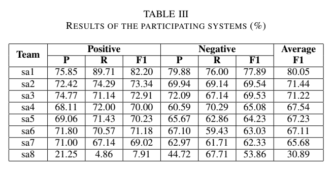
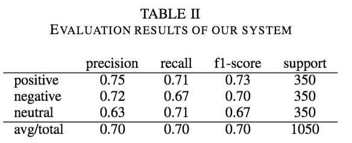

# VLSP-2016 evaluation campaign: Sentiment Analysis

## Reproduce the results of the technical report

Run the script ```SA_submission_method.py```

    python SA_submission_method.py [output]

[output] is the name of the output file. It is optional.

## Evaluate the result

Use the script ```evaluate.py```

    python evaluate.py minhpqn_ftri_SA_submission.txt data/Evaluation/SA2016-TestData-Ans/test_tokenized_ANS.txt

## Sample some errors made by my system on the test set

Use the script ```sample_erros.py```

    python evaluate.py minhpqn_ftri_SA_submission.txt data/Evaluation/SA2016-TestData-Ans/test_tokenized_ANS.txt N

In which N is the number of samples for each class (POS, NEG, NEU)

## Official Evaluation Results

Our system rank third (system **sa3**) in VLSP Evaluation Campaign.
The following table shows precision, recall, F1 score 
for positive, negative categories and the average F1 of the two 
categories.



The following tables shows the results for three categories
positive, negative, and neutral.




